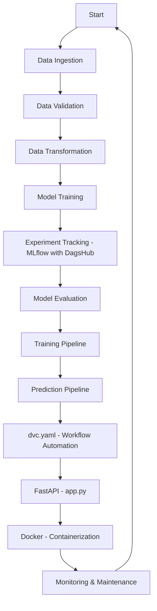
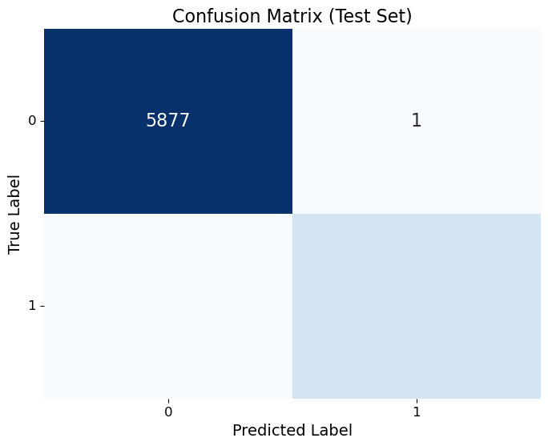
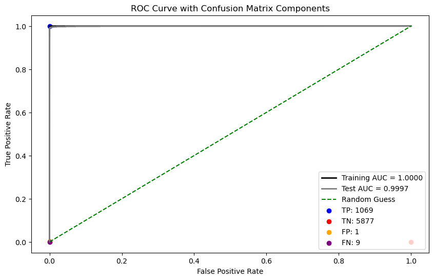

# 👨‍💼 Application of Data Science to Reduce Employee Attrition 👨‍💼


📌 Abstract

Employee retention is a critical challenge for organizations, as losing skilled employees can result in substantial financial and operational setbacks. Traditionally, Human Resources (HR) departments have relied on manual approaches—such as employee interviews and feedback analysis—to identify factors leading to attrition. However, these methods are often time-consuming, subjective, and inefficient.

With advancements in Data Science and predictive analytics, organizations can now leverage machine learning models to automate attrition prediction, enabling proactive decision-making. By analyzing various employee attributes, businesses can gain actionable insights to minimize turnover, reduce recruitment costs, and enhance workforce stability.

🎯 Problem Statement

The objective of this project is to develop a machine learning model that predicts employee attrition at IBM. The dataset consists of employee-specific details, including demographics, job roles, salary structures, and attrition status.

By utilizing classification models, we aim to:

Accurately predict whether an employee is likely to leave the company.

Identify key factors contributing to employee attrition.

Provide HR departments with data-driven strategies to improve employee retention.

---

## 📊 Dataset Overview

This dataset, sourced from **IBM**, contains approximately **24,000 employee records** with attributes related to job satisfaction, salary, work-life balance, and more. The objective is to **identify attrition trends** and enhance business decision-making.

### 🔹 Target Feature:
- **Attrition** 

### 🔹 Categorical Features:
- Business Travel, Department, EducationField, Gender, JobRole, MaritalStatus, Over18, OverTime, Employee Source

### 🔹 Numerical Features:
- Age, DailyRate, DistanceFromHome, Education, EmployeeCount, EnvironmentSatisfaction, HourlyRate, JobInvolvement, JobLevel, JobSatisfaction, MonthlyIncome, MonthlyRate, NumCompaniesWorked, PercentSalaryHike, PerformanceRating, RelationshipSatisfaction, StandardHours, StockOptionLevel, TotalWorkingYears, TrainingTimesLastYear, WorkLifeBalance, YearsAtCompany, YearsInCurrentRole, YearsSinceLastPromotion, YearsWithCurrManager

🔗 **Dataset Link**: [IBM HR Analytics Attrition Dataset](https://www.kaggle.com/datasets/pavansubhasht/ibm-hr-analytics-attrition-dataset)

---

## 🔍 Data Preprocessing & Analysis

### 📌 Exploratory Data Analysis (EDA)
- **Data Visualization:** Used catplots, pie charts,Plotly,box plots and bar plots to analyze feature distributions.
- **Insights Extraction:** Identified key attrition drivers based on job roles, salary, and experience.

### 🛠️ Data Cleaning & Feature Engineering
- **Removed irrelevant features** to optimize model performance.
- **Handled missing values** with appropriate imputation techniques.
- **Applied label encoding & one-hot encoding** for categorical variables.

### 🏆 Model Evaluation
- **Performance Metrics:** ROC, AUC, Recall, Accuracy, Precision, Confusion matrix, Classification Report

---

## 🛑 Technologies & Libraries Used

### 🔹 Python Libraries:
- **Pandas** - Data manipulation
- **NumPy** - Numerical computations
- **Matplotlib & Seaborn** - Data visualization
- **Scikit-learn** - Machine learning & model evaluation
- **Statsmodels** - Statistical modeling
- **SciPy** - Scientific computing
- **Plotly** - Interactive visualizations

### 🔹 Machine Learning Models Implemented:

| Model                          | Description                         |
|--------------------------------|-------------------------------------|
| **Logistic Regression**        | Baseline classification model      |
| **GaussianNB**                 | Probabilistic classification       |
| **Decision Tree Classifier**   | Rule-based decision-making        |
| **Random Forest Classifier**   | Ensemble learning method          |
| **AdaBoost Classifier**        | Adaptive boosting approach        |
| **Gradient Boosting Classifier** | Sequential tree-based model      |
| **K-Nearest Neighbors**        | Distance-based classification      |
| **XGBoost Classifier**         | Optimized gradient boosting       |

### 🔹 Preprocessing & Feature Selection:
- **StandardScaler** - Feature scaling
- **LabelEncoder & OneHotEncoder** - Encoding categorical variables
- **SMOTE** - Handling class imbalance

---

## 🚀 End-to-End Machine Learning Workflow with DVC, MLflow & FastAPI  

### 📌 Project Overview  
This project demonstrates an **end-to-end machine learning pipeline** using **DVC (Data Version Control), MLflow, DagsHub, and FastAPI**. The workflow follows a structured approach for:  
👉 **Data ingestion & validation**  
👉 **Model training & evaluation**  
👉 **Experiment tracking with MLflow in DagsHub**  
👉 **Deployment with FastAPI & Docker**  
👉 **version control using DVC**  

---

## 🔥 Workflow Overview  



### 🛠️ Run the Workflow

```bash
# Clone the repository
git clone https://github.com/Prajwalpatelp/Employee_Attrition.git

# Creating Virtual Environment
python -m venv venv

# Activating the Virtual Environment (Windows Command Prompt)
venv\Scripts\activate

# Install dependencies
pip install -r requirements.txt

# Run Training Pipeline
python src/employee/pipeline/Training_pipeline.py

# Run Prediction Pipeline
python src/employee/pipeline/Prediction_pipeline.py

# Run DVC pipeline
dvc repro

# Run FastAPI app
uvicorn app:app --host 0.0.0.0 --port 8000

# Build Docker Image
docker build -t employee-attrition:latest .

# Run Docker Container
docker run -p 8000:8000 employee-attrition:latest

## Pull the Docker Image

To pull the latest Docker image, use the following command:
```sh
docker pull prajwalpatel/fastapi-employee_attrition:latest

```

---

## 🌟 Model Performance: XGBoost Classifier

Using several models, the **XGBoost classifier** provided the best results:

### 🔍 Recall
- **Training Recall**: 99.91%
- **Test Recall**: 99.17%

### 🎯 Accuracy
- **Training Accuracy**: 99.96%
- **Test Accuracy**: 99.86%

### ✅ Precision
- **Training Precision**: 100.00%
- **Test Precision**: 99.91%

### 📈 AUC (Area Under the Curve)
- **Training AUC**: 100.00%
- **Test AUC**: 99.97%

### 📊 Confusion Matrix & AUC-ROC Curve

  
  

### 🏆 Summary
The **XGBoost Classifier** exhibits exceptional performance with near-perfect metrics:
👉 Strong generalization capabilities  
👉 High classification quality  
👉 Minimizes both false positives & false negatives  

---

## 💚 Contact Information  
👉 **For any questions or feedback, please contact:** [prajwalkumar2228@gmail.com](mailto:prajwalkumar2228@gmail.com) 💎

